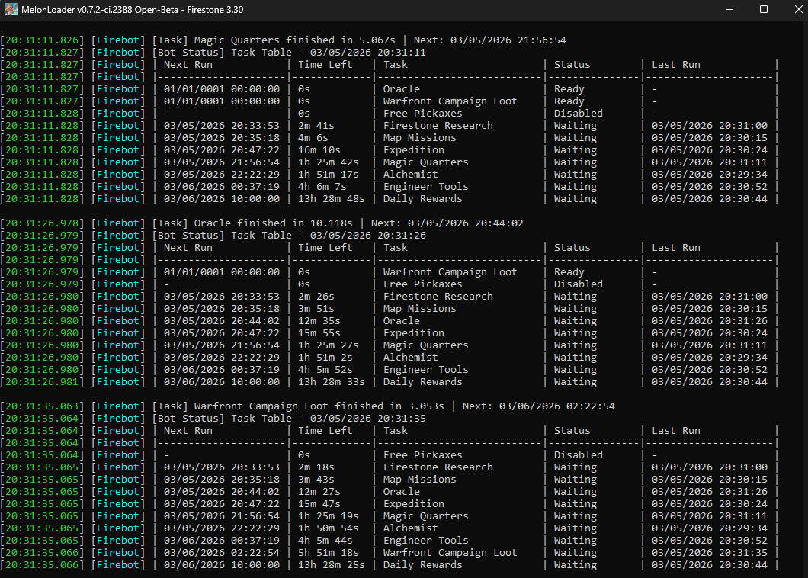

# Firebot

Automation bot for Firestone Idle RPG, enhancing gameplay by automating repetitive tasks using MelonLoader.

Firebot can run in the background and supports any game language, making it flexible for all players.

This bot aims to enhance the gaming experience by automating various tasks and providing useful features for players.

---

## About

This project is a mod for the game Firestone Idle RPG, using [MelonLoader](https://github.com/LavaGang/MelonLoader) **Nightly V0.7.2+**.

> **Note:** Firebot is currently supported only on **Windows**. The mod works with Firestone Idle RPG in **any game language**, at **any resolution**, and can run in the **background**.

---

## Features

- **Offline Progress**: Automatically claims offline progress rewards
- **Tools Production** (Engineer): Automatically collects produced tools from the Engineer
- **Warfront Campaign**: Automatically collects Warfront campaign scrolls
- **Missions**: Manages missions automatically - claims completed mission rewards and starts new missions with available squads
- **Expeditions**: Manages expeditions - claims completed expedition rewards and starts new expeditions when available
- **Firestone Research** (Library): Automatically starts research and claims completed research
- **Oracle Rituals**: Claims completed rituals and starts new rituals when available
- **Guardian Training** (Magic Quarters): Automatically initiates guardian training

---

## How to Use (Pre-built Release)

If you want to use the pre-built mod, follow these steps:

1. **Download** the latest release from the [Releases](https://github.com/yourusername/firestone-bot/releases) page (e.g., `v0.2.2-alpha.zip`).

2. **Extract** the contents of the zip file into the root folder of Firestone Idle RPG (where the game executable is located).
   - The zip file already contains the `Mods`, `UserData`, and `UserLibs` folders with all necessary files.
   - If prompted, allow overwriting existing files.
3. Make sure [MelonLoader Nightly V0.7.2+](https://github.com/LavaGang/MelonLoader) is installed in your game.
4. Start the game normally. Firebot will be loaded automatically by MelonLoader.

By default, press **F7** to start or stop the bot during gameplay.

---

## Installation (From Source)

1. Clone the repository:

   ```bash
   git clone https://github.com/danilogmoura/firestone-bot.git
   ```

2. Navigate to the project directory:

   ```bash
   cd firebot
   ```

3. Configure the path to your Firestone Idle RPG game directory by editing the `src/Directory.Build.props` file if needed:
    - By default, the path is set to `C:\Program Files (x86)\Steam\Firestone` (Windows). If your game is installed elsewhere, change the `<GameRoot>` property in this file to the correct path.
    - You can also set the environment variable `COMMON_DIR` to override the base directory. In this case, the game path will be `$(COMMON_DIR)\Firestone`.
      - Example:

          ```xml
          <GameRoot>C:\Program Files (x86)\Steam\Firestone</GameRoot>
          ```

4. Build the project using your preferred method (e.g., Visual Studio, command line).

---

## CONFIG

The bot configuration file can be found at `Firestone/UserData/FirebotPreferences.cfg`.

Default toggle key: **F7** (changeable via `shortcut_key`).

For now, all configuration must be done directly in this file. A graphical configuration interface will be implemented in the future.

Here is a list of the current config options (and their default values):

---

```toml
[firebot_settings]
# Determines if the bot logic should be initialized and started automatically upon game launch.
auto_start = false
# The initial cooldown (in seconds) before the bot begins execution.
# Useful for preventing conflicts while Unity is still loading the initial scene.
# Clamped between 10.0 and 120.0 seconds.
start_bot_delay = 10.0
# The interval (in seconds) between each BotManager verification cycle.
# Lower values make the bot more responsive but may impact FPS performance.
# Clamped between 5.0 and 3600.0 seconds.
scan_interval = 5.0
# The delay (in seconds) between individual UI interactions (clicks, transitions).
# Ensures the game processes the command before the next action is taken. 
# Clamped between 0.5 and 5.0 seconds.
interaction_delay = 1.0
# Maximum time (in seconds) a single task is allowed to run before it is aborted.
# Clamped between 10.0 and 3600.0 seconds.
max_task_runtime = 120.0
# Enables verbose logging and StackTrace display in the console for easier bug identification.
debug_mode = false
# The physical key used to manually toggle the bot's execution state during gameplay.
shortcut_key = "F7"
# Some timers in the game can be sped up for free if the remaining time is below this threshold (default: 170 seconds = 2 minutes and 50 seconds). The maximum allowed value is 180 seconds (3 minutes). Adjust this value to account for lag or future game changes. Affects firestone researches, missions, experiments, and map reset timers. If the remaining time is less than or equal to this value, the speedup is free (no gems required).
free_speedup_seconds = 170.0

[engineer_tools]
# Enables or disables the Engineer Tools automation task.
# When disabled, this task will be ignored during the execution loop.
enabled = false

[firestone_research]
# Enables or disables the Firestone Research automation task.
# When disabled, this task will be ignored during the execution loop.
enabled = false
# FIRESTONE RESEARCH TALENT TREE PRIORITY CONFIGURATION. 
# This setting controls which talents are researched first based on their tree position. 
# TALENT IDs ARE ASSIGNED BY INDEX (ordered top to bottom, left to right within each tree screen). 
# Valid IDs for user input range from 1 to 16. 
# You may specify any combination of IDs from 1 to 16, in any order you prefer. The bot will follow the exact order you provide. 
# TREE I EXAMPLE - ID 1=Attribute damage, ID 2=Attribute health, ID 3=Attribute armor, ID 4=Fist fight, ID 5=Guardian power, ID 6=Projectiles, 
# ID 7=Raining gold, ID 8=Critical loot Bonus, ID 9=Critical loot Chance, ID 10=Weaklings, ID 11=Expose Weakness, 
# ID 12=Medal of honor, ID 13=Firestone Finder, ID 14=Trainer Skills, ID 15=Skip wave, ID 16=Expeditioner. 
# HOW TO USE: Enter comma-separated IDs in priority order (integers between 1-16). The bot will research talents in the exact sequence provided. 
# If a priority talent is unavailable (locked/completed), the bot will try the next priority. 
# If all priorities are unavailable or if this field is empty, the bot will select any available talent automatically. 
# EXAMPLES: '2,1,4' = Research Attribute health first, then Attribute damage, then Fist fight. 
# '7,8,9' = Research Raining gold first, then Critical loot Bonus, then Critical loot Chance. 
# '13' = Only research Firestone Finder, fallback to any available if completed. 
# '5,12,1,16,3,8,10,2,14,7,4,15,6,13,9,11' = Example using all 16 IDs in a random order, each ID only once. 
# Default: empty (no priority, bot selects any available talent)
research_priority = ""

[magic_quarters]
# Enables or disables the Magic Quarters automation task.
# When disabled, this task will be ignored during the execution loop.
enabled = false
# Select guardian index for training. Use 0-3. Default is 0.
# 0=Vermilion, 1=Grace, 2=Ankaa, 3=Azhar
guardian_index = 0
# Use 'Strange Dust' for training. Default is false.
use_strange_dust = false

[oracle]
# Enables or disables the Oracle automation task.
# When disabled, this task will be ignored during the execution loop.
enabled = false

[map_missions]
# Enables or disables the Map Missions automation task.
# When disabled, this task will be ignored during the execution loop.
enabled = false
# Sort missions by time required. Use 'asc' (shorter first) or 'desc' (longer first).
mission_time_order = "desc"

[warfront_campaign_loot]
# Enables or disables the Warfront Campaign Loot automation task.
# When disabled, this task will be ignored during the execution loop.
enabled = false

[expedition]
# Enables or disables the Expedition automation task.
# When disabled, this task will be ignored during the execution loop.
enabled = false

[free_pickaxes]
# Enables or disables the Free Pickaxes automation task.
# When disabled, this task will be ignored during the execution loop.
enabled = false
# Minimum number of free pickaxes required before claiming. Set to 1 to claim as soon as available, or up to 30 to wait for maximum. Default is 30 (wait for maximum).
pickaxe_claim_threshold = 30
```

## Example: Bot Info Log



---

## Roadmap & Next Steps

### v0.3.0 - Gameplay Expansion (Feature Update)

*The big feature jump, utilizing the new structure created in previous versions.*

- [ ] **Feature:** Daily Rewards automation.
- [ ] **Feature:** Alchemist automation.
- [ ] **Feature:** Liberation automation.

### Future Plans (v0.4.0+)

- [ ] **UI:** Full in-game configuration interface (No more `.cfg` files needed).

---

## Bug Reporting & Feature Requests

Found a bug or have an idea for a new feature? Please open a ticket on our GitHub Issue Tracker!

**Before submitting a bug report:**

1. Check if the issue has already been reported.
2. Ensure you are using the latest version of Firebot.
3. Attach your **MelonLoader Log** file (`MelonLoader/Latest.log`) if the game crashed or the bot failed.

[**Open a New Issue**](https://github.com/danilogmoura/firebot/issues/new/choose)

---

## Contributing

Contributions are welcome! Please submit a pull request or open an issue for suggestions or improvements.

## Disclaimer: Not a Cheat

Firebot **is not a cheat**. It does not modify game resources, grant unfair advantages, interfere with server logic, or alter game files. The bot only automates actions that a player could perform manually, without bypassing any security or protection mechanisms of the game.

## Technical Details

- Firebot is implemented as a mod using MelonLoader, enabling automation of repetitive tasks within the game client itself.
- All actions performed by the bot simulate clicks and commands that a user would normally do, without modifying server data or circumventing security systems.
- The code is open source and auditable, ensuring transparency about its operation.
