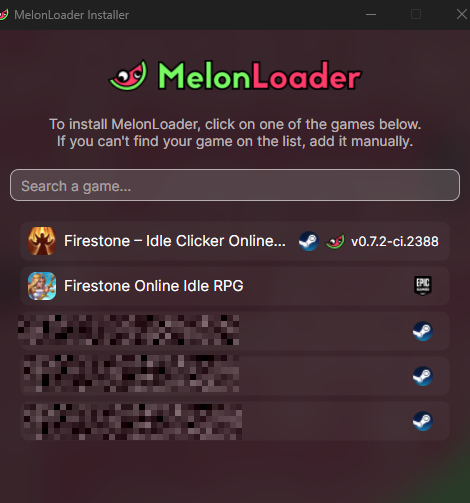
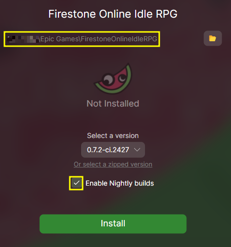
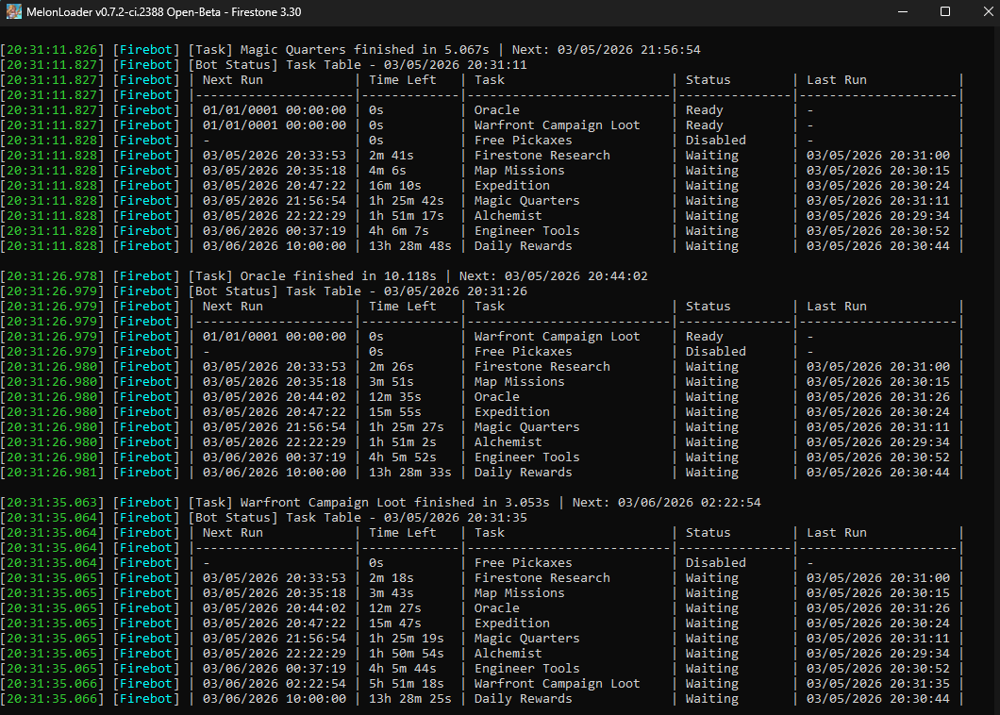

# Firebot

Automation bot for Firestone Idle RPG, focused on automating repetitive tasks through MelonLoader.

Firebot runs in the background and supports any game language.

## Quick Start

1. Install [MelonLoader V0.7.2+](https://github.com/LavaGang/MelonLoader/releases/latest) in `Firestone.exe`.
2. Download the latest Firebot release and extract it into the Firestone root folder.
3. Launch the game and press `F7` to toggle Firebot.

---

## About

This project is a mod for Firestone Idle RPG using [MelonLoader](https://github.com/LavaGang/MelonLoader).

> **Note:** Firebot is currently supported only on **Windows**. It works with Firestone installations from **Steam** and **Epic Games**. The mod works in **any game language**, at **any resolution**, and can run in the **background**.

## Disclaimer: Not a Cheat

Firebot **is not a cheat**. It does not modify game resources, grant unfair advantages, interfere with server logic, or alter game files. The bot only automates actions that a player could perform manually, without bypassing any security or protection mechanisms of the game.

> **Transparency:** Firebot is open source, and its code is publicly available for review and audit.

---

## Features

- **Easy Start/Stop**: Turn the bot on or off during gameplay with a hotkey (default `F7`, `shortcut_key`). You can also auto-start and adjust bot timings with `auto_start`, `start_bot_delay`, `scan_interval`, `interaction_delay`, and `max_task_runtime`.
- **Automatic Daily Rewards**: Collects daily rewards for you when they are available.
- **Engineer Collection**: Picks up ready Engineer tools automatically.
- **Warfront Rewards**: Collects available Warfront campaign scroll rewards.
- **Map Missions on Auto**: Collects finished missions and starts new ones with available squads. You can choose mission order with `mission_time_order` (`asc` or `desc`).
- **Expeditions on Auto**: Finishes and restarts expeditions automatically.
- **Library Research Automation**: Starts and collects Firestone research, with optional priority order using `research_priority`.
- **Oracle Automation**: Collects completed rituals and starts new ones when possible.
- **Guardian Training Automation**: Starts training in Magic Quarters automatically. You can choose the guardian with `guardian_index` and enable strange dust usage with `use_strange_dust`.
- **Alchemist Automation**: Runs alchemist experiments and can focus on specific resources using `resource_type`.
- **Free Pickaxe Claiming**: Claims free pickaxes automatically based on your preferred quantity with `pickaxe_claim_threshold`.
- **AutoSkill Mode**: Uses leader skills automatically, with its own key (`[auto_skill].shortcut_key`) and combo setup (`combo_sequence`).
- **AutoUpgrade Mode**: Upgrades heroes/skills automatically, with its own key (`[auto_upgrade].shortcut_key`) and optional slot selection (`upgrade_target_slots`).
- **Free Speedups**: Uses free speedups (no gems) whenever a timer is close enough to finish, based on `free_speedup_seconds`.

---

## Downloads

- **MelonLoader**: <https://github.com/LavaGang/MelonLoader/releases/latest>
- **Latest Firebot Release**: <https://github.com/danilogmoura/firestone-bot/releases/latest>

---

## How to Use (Prebuilt Release)

If you want to use the pre-built mod (no manual compilation), follow this step-by-step guide.

### 1) Install MelonLoader (Required)

1. Download [MelonLoader V0.7.2+](https://github.com/LavaGang/MelonLoader/releases/latest).
2. Run the MelonLoader installer.
3. In the installer, keep **Enable Nightly builds** checked and select a `0.7.2-ci` (or newer) version.
4. When asked for the game executable, select your `Firestone.exe` file (inside your Firestone install folder).
5. Finish installation and wait until the installer confirms success.

<p align="center">
   
   
</p>

<p align="center">
   <sub>Left: game selection in installer | Right: keep <strong>Enable Nightly builds</strong> checked</sub>
</p>

Quick check: after installation, the game folder should contain MelonLoader-related files/folders (for example `MelonLoader`).

### 2) Install Firebot Files (Required)

1. Download the latest Firebot package from [Releases](https://github.com/danilogmoura/firestone-bot/releases/latest) (example: `v0.2.7-alpha.zip`).
2. Extract the zip contents into the Firestone root folder (same folder as `Firestone.exe`).
3. Allow overwrite if Windows asks.

The zip already includes the correct structure (`Mods`, `UserData`).

### 3) First Launch (Required)

1. Start Firestone normally (through **Steam** or **Epic Games**).
2. Wait for the game to fully load.
3. Press **F7** to toggle Firebot on/off.

### 4) How to Update Firebot (When Needed)

When a new Firebot version is released, you do not need to reinstall everything.

1. **Close the game completely**.
2. Download the new release package from [Releases](https://github.com/danilogmoura/firestone-bot/releases/latest).
3. Replace only this file in your game folder: `Mods/firebot.dll`.
4. Start the game once so Firebot can load the new version.

If the new version includes additional configuration options, they will be added automatically to your existing `FirebotPreferences.cfg` on the first execution.

When you want to adjust these options, follow the safe configuration flow in section `5) Configure Firebot correctly`.

### 5) Configure Firebot Correctly (Required)

The configuration file is:

`Firestone/UserData/FirebotPreferences.cfg`

To ensure your configuration is applied safely, always use this sequence:

1. **Close the game completely**.
2. Edit `FirebotPreferences.cfg`.
3. Save the file.
4. Open the game again.

If you change settings while the game is open, the new values may not be applied correctly.

### 6) Troubleshooting with MelonLoader Logs (Optional)

- Main runtime log: `Firestone/MelonLoader/Latest.log`
- Use this log if Firebot does not load, does not start with `F7`, or behaves unexpectedly.
- In most cases, checking this file is the fastest way to identify installation or configuration issues.

### Example Bot Info Log

<p align="center">
   
</p>

### 7) If the Game Updates and Firebot Stops Working

If the game changes version and Firebot does not work correctly, use one of the methods below.

#### Method 1: Assembly Cache Cleanup

1. Close the game completely.
2. Go to your game folder and delete all contents inside `MelonLoader/Il2CppAssemblies`.
3. In `MelonLoader/Dependencies/Il2CppAssemblyGenerator`, keep only:
   - `Il2CppAssemblyGenerator.deps.json`
   - `Il2CppAssemblyGenerator.dll`
4. Delete `MelonLoader/Dependencies/AssemblyUnhollower` (if it exists).
5. Start the game again.
6. Replace only `Mods/firebot.dll` with the latest version.

#### Method 2: Reinstall MelonLoader

1. Close the game completely.
2. Delete the `MelonLoader` folder from the game root.
3. Reinstall MelonLoader as described in this README.
4. Replace only `Mods/firebot.dll` with the latest version.
5. Start the game again.

Important: no matter which method you choose, always replace only `Mods/firebot.dll` to update Firebot.

---

## Configuration

Configuration reference file: `Firestone/UserData/FirebotPreferences.cfg`.

For the safe editing workflow (close game -> edit -> reopen), follow section `5) Configure Firebot correctly`.

For now, all configuration must be done directly in this file. A graphical configuration interface will be implemented in the future.

Here is a list of the current configuration options (and their default values):

---

```toml
[firebot_settings]
# Determines if the bot logic should be initialized and started automatically upon game launch.
auto_start = false
# The initial cooldown (in seconds) before the bot begins execution.
# Useful for preventing conflicts while Unity is still loading the initial scene.
# Clamped between 10.0 and 120.0 seconds.
start_bot_delay = 10.0
# The interval (in seconds) between each BotManager verification cycle.
# Lower values make the bot more responsive but may impact FPS performance.
# Clamped between 5.0 and 3600.0 seconds.
scan_interval = 5.0
# The delay (in seconds) between individual UI interactions (clicks, transitions).
# Ensures the game processes the command before the next action is taken. 
# Clamped between 0.5 and 5.0 seconds.
interaction_delay = 1.0
# Maximum time (in seconds) a single task is allowed to run before it is aborted.
# Clamped between 10.0 and 3600.0 seconds.
max_task_runtime = 120.0
# Enables verbose logging and StackTrace display in the console for easier bug identification.
debug_mode = false
# The physical key used to manually toggle the bot's execution state during gameplay.
shortcut_key = "F7"
# Some timers in the game can be sped up for free if the remaining time is below this threshold (default: 170 seconds = 2 minutes and 50 seconds). The maximum allowed value is 180 seconds (3 minutes). Set to 0 to disable free speedup. Adjust this value to account for lag or future game changes. Affects firestone researches, missions, experiments, and map reset timers. If the remaining time is less than or equal to this value, the speedup is free (no gems required).
free_speedup_seconds = 170.0

[alchemist]
# Enables or disables the Alchemist automation task.
# When disabled, this task will be ignored during the execution loop.
enabled = false
# ALCHEMIST EXPERIMENT RESOURCE CONFIGURATION. 
# This setting controls which experiment resources are used. 
# Valid IDs: 0=Dragon blood, 1=Strange dust, 2=Exotic coin. 
# Enter comma-separated IDs (e.g. '0,1,2'). 
# Any value other than 0, 1, or 2 will be ignored. 
# Default: empty (no resources, bot selects any available resource). 
# EXAMPLES: '0,1' = Use Dragon blood and Strange dust. '2' = Only use Exotic coin.
resource_type = ""

[daily_rewards]
# Enables or disables the Daily Rewards automation task.
# When disabled, this task will be ignored during the execution loop.
enabled = false

[engineer_tools]
# Enables or disables the Engineer Tools automation task.
# When disabled, this task will be ignored during the execution loop.
enabled = false

[firestone_research]
# Enables or disables the Firestone Research automation task.
# When disabled, this task will be ignored during the execution loop.
enabled = false
# FIRESTONE RESEARCH TALENT TREE PRIORITY CONFIGURATION. 
# This setting controls which talents are researched first based on their tree position. 
# TALENT IDs ARE ASSIGNED BY INDEX (ordered top to bottom, left to right within each tree screen). 
# Valid IDs for user input range from 1 to 16. 
# You may specify any combination of IDs from 1 to 16, in any order you prefer. The bot will follow the exact order you provide. 
# TREE I EXAMPLE - ID 1=Attribute damage, ID 2=Attribute health, ID 3=Attribute armor, ID 4=Fist fight, ID 5=Guardian power, ID 6=Projectiles, 
# ID 7=Raining gold, ID 8=Critical loot Bonus, ID 9=Critical loot Chance, ID 10=Weaklings, ID 11=Expose Weakness, 
# ID 12=Medal of honor, ID 13=Firestone Finder, ID 14=Trainer Skills, ID 15=Skip wave, ID 16=Expeditioner. 
# HOW TO USE: Enter comma-separated IDs in priority order (integers between 1-16). The bot will research talents in the exact sequence provided. 
# If a priority talent is unavailable (locked/completed), the bot will try the next priority. 
# If all priorities are unavailable or if this field is empty, the bot will select any available talent automatically. 
# EXAMPLES: '2,1,4' = Research Attribute health first, then Attribute damage, then Fist fight. 
# '7,8,9' = Research Raining gold first, then Critical loot Bonus, then Critical loot Chance. 
# '13' = Only research Firestone Finder, fallback to any available if completed. 
# '5,12,1,16,3,8,10,2,14,7,4,15,6,13,9,11' = Example using all 16 IDs in a random order, each ID only once. 
# Default: empty (no priority, bot selects any available talent)
research_priority = ""

[magic_quarters]
# Enables or disables the Magic Quarters automation task.
# When disabled, this task will be ignored during the execution loop.
enabled = false
# Select guardian index for training. Use 0-3. Default is 0.
# 0=Vermilion, 1=Grace, 2=Ankaa, 3=Azhar
guardian_index = 0
# Use 'Strange Dust' for training. Default is false.
use_strange_dust = false

[oracle]
# Enables or disables the Oracle automation task.
# When disabled, this task will be ignored during the execution loop.
enabled = false

[map_missions]
# Enables or disables the Map Missions automation task.
# When disabled, this task will be ignored during the execution loop.
enabled = false
# Sort missions by time required. Use 'asc' (shorter first) or 'desc' (longer first).
mission_time_order = "desc"

[warfront_campaign_loot]
# Enables or disables the Warfront Campaign Loot automation task.
# When disabled, this task will be ignored during the execution loop.
enabled = false

[expedition]
# Enables or disables the Expedition automation task.
# When disabled, this task will be ignored during the execution loop.
enabled = false

[free_pickaxes]
# Enables or disables the Free Pickaxes automation task.
# When disabled, this task will be ignored during the execution loop.
enabled = false
# Minimum number of free pickaxes required before claiming. Set to 1 to claim as soon as available, or up to 30 to wait for maximum. Default is 30 (wait for maximum).
pickaxe_claim_threshold = 30

[auto_skill]
# The physical key used to manually toggle the AutoSkill execution state during gameplay. Default: F8.
shortcut_key = "F8"
# Enables or disables the AutoSkill automation task. When disabled, this task will be ignored during the execution loop. Default: false.
enabled = false
# Combo sequence as comma-separated numbers. Example: '1' will spam hotkey 1, '2,1,2' will execute hotkey 2, then 1, then 2, and repeat. Only values 1, 2, or 3 are valid. Default: 1.
combo_sequence = "1"

[auto_upgrade]
# The physical key used to manually toggle the AutoUpgrade execution state during gameplay. Default: F6.
shortcut_key = "F6"
# Enables or disables the AutoUpgrade automation task. When disabled, this task will be ignored during the execution loop. Default: false.
enabled = false
# AUTOUPGRADE TARGET SLOT CONFIGURATION. 
# This setting controls which upgrade slots (heroes/skills) will be upgraded. 
# SLOT IDs ARE ZERO-BASED and range from 0 to 6. 
# ORIENTATION: Slot numbering follows the list from top to bottom. 
# SLOT MAP: 0 = Base upgrade, 1 = Guardian, 2 to 6 = Heroes. 
# TASK PRIORITY: Main bot tasks always have priority over AutoUpgrade. 
# AUTO PAUSE/RESUME: When a main task is approaching, AutoUpgrade pauses about 30 seconds before that task runs, allows the task to execute, and then resumes automatically. 
# HOW TO USE: Enter comma-separated slot IDs to select the targets to upgrade. 
# EXAMPLES: '0,6' = only slots 0 and 6 will be upgraded. '3,1,5' = only slots 3, 1 and 5. 
# If empty, AutoUpgrade will upgrade all visible slots. 
# Invalid values are ignored.
upgrade_target_slots = ""
```

---

## Installation (From Source)

1. Clone the repository:

   ```bash
   git clone https://github.com/danilogmoura/firestone-bot.git
   ```

2. Navigate to the project directory:

   ```bash
   cd firebot
   ```

3. Configure the path to your Firestone Idle RPG game directory by editing the `src/Directory.Build.props` file if needed:
    - By default, the path is set to `C:\Program Files (x86)\Steam\Firestone` (Windows). If your game is installed elsewhere, change the `<GameRoot>` property in this file to the correct path.
    - You can also set the environment variable `COMMON_DIR` to override the base directory. In this case, the game path will be `$(COMMON_DIR)\Firestone`.
      - Example:

          ```xml
          <GameRoot>C:\Program Files (x86)\Steam\Firestone</GameRoot>
          ```

4. Build the project using your preferred method (e.g., Visual Studio, command line).

---

## Contributing

Contributions are welcome! Please submit a pull request or open an issue for suggestions or improvements.

## Roadmap & Next Steps

### Future Plans (v0.3.0+)

- [ ] **UI:** Full in-game configuration interface (No more `.cfg` files needed).

---

## Bug Reporting & Feature Requests

Found a bug or have an idea for a new feature? Please open a ticket on our GitHub Issue Tracker!

**Before submitting a bug report:**

1. Check if the issue has already been reported.
2. Ensure you are using the latest version of Firebot.
3. Attach your **MelonLoader Log** file (`MelonLoader/Latest.log`) if the game crashed or the bot failed.

[**Open a New Issue**](https://github.com/danilogmoura/firebot/issues/new/choose)

---

## Technical Details

- Firebot is implemented as a mod using MelonLoader, enabling automation of repetitive tasks within the game client itself.
- All actions performed by the bot simulate clicks and commands that a user would normally do, without modifying server data or circumventing security systems.
- The code is open source and auditable, ensuring transparency about its operation.
