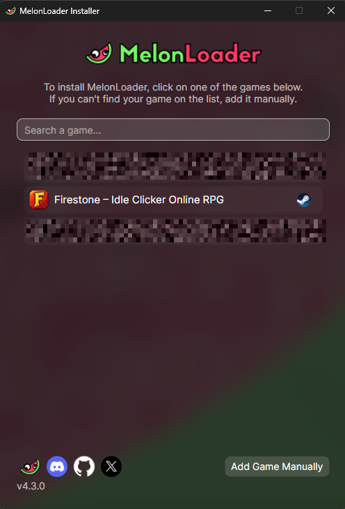
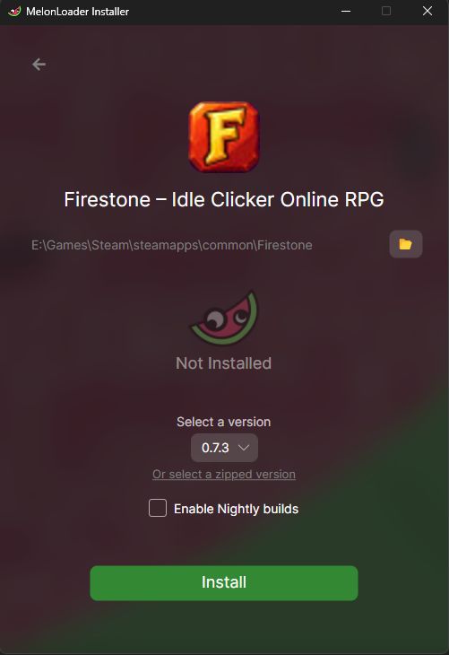
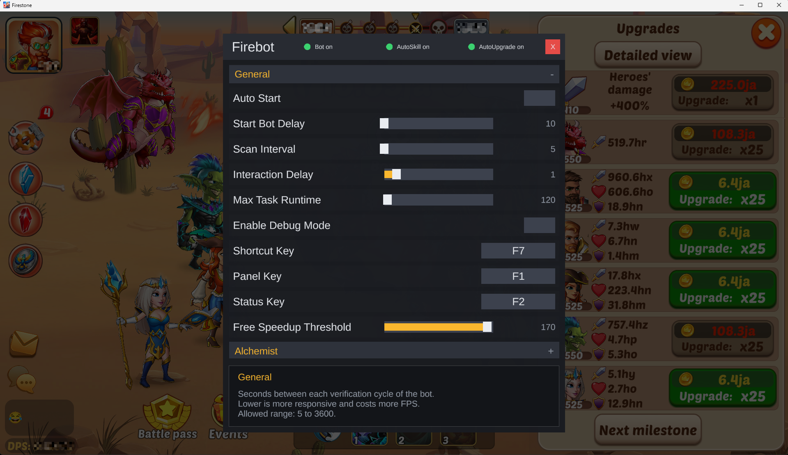
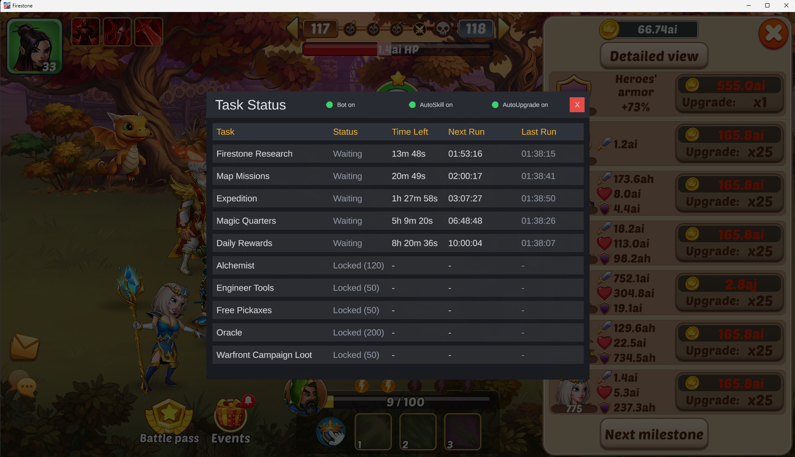

# Firebot

[](https://discord.gg/JB8RJAs6J3)

Automation bot for Firestone Idle RPG, focused on automating repetitive tasks through MelonLoader.

## Quick Start

1. Install [MelonLoader V0.7.3+](https://github.com/LavaGang/MelonLoader/releases/latest) in `Firestone.exe`.
2. Download the latest Firebot release and extract it into the Firestone root folder.
3. Launch the game and press `F7` to toggle Firebot. Press `F1` for the settings panel and `F2` for the task status.

For the detailed step-by-step guide, see [How to Use (Prebuilt Release)](#how-to-use-prebuilt-release).

---

## About

This project is a mod for Firestone Idle RPG using [MelonLoader](https://github.com/LavaGang/MelonLoader).

> **Note:** Firebot is currently supported only on **Windows**. It works with Firestone installations from **Steam** and **Epic Games**. The mod works in **any game language**, at **any resolution**, and can run in the **background**.

## Disclaimer: Not a Cheat

Firebot **is not a cheat**. It does not modify game resources, grant unfair advantages, interfere with server logic, or alter game files. The bot only automates actions that a player could perform manually, without bypassing any security or protection mechanisms of the game.

> **Transparency:** Firebot is open source, and its code is publicly available for review and audit.

---

## Features

- **Easy Start/Stop**: Toggles the bot on or off during gameplay with a hotkey (default `F7`), plus optional auto-start and timing controls.
- **In-Game Settings Panel**: Every task can be enabled, disabled and tuned from inside the game, with its own hotkey (default `F1`). No file editing, and the changes are saved as you make them.
- **Task Status Screen**: One row per task with its state, time left, next run and last run, shown on its own screen (default `F2`) instead of read from a log.
- **Level-Aware Tasks**: A task whose feature the game has not unlocked yet is held back, shown as `LevelLocked` on the status screen, and starts on its own once the character reaches the level it needs.
- **Automatic Daily Rewards**: Collects daily rewards when available.
- **Engineer Collection**: Picks up ready Engineer tools automatically.
- **Warfront Rewards**: Collects available Warfront campaign scroll rewards.
- **Map Missions on Auto**: Collects finished missions and starts new ones with available squads.
- **Expeditions on Auto**: Finishes and restarts expeditions automatically.
- **Library Research Automation**: Starts and collects Firestone research.
- **Oracle Automation**: Collects completed rituals and starts new ones when possible.
- **Guardian Training Automation**: Starts training in Magic Quarters automatically.
- **Alchemist Automation**: Runs alchemist experiments and can focus on specific resources.
- **Free Pickaxe Claiming**: Claims free pickaxes automatically.
- **AutoSkill Mode**: Uses leader skills automatically, with its own hotkey (default `F8`) and combo sequence.
- **AutoUpgrade Mode**: Upgrades heroes/skills automatically, with its own hotkey (default `F6`) and optional slot selection.
- **Free Speedups**: Uses free speedups (no gems) whenever a timer is close to finishing.

Every task can be enabled, disabled and tuned in the [in-game panel](#5-configure-firebot-required). The [`FirebotPreferences.cfg`](#configuration) file holds the same settings for those who prefer to edit it directly.

---

## Downloads

- **MelonLoader**: <https://github.com/LavaGang/MelonLoader/releases/latest>
- **Latest Firebot Release**: <https://github.com/danilogmoura/firestone-bot/releases/latest>

---

## How to Use (Prebuilt Release)

If you want to use the pre-built mod (no manual compilation), follow this step-by-step guide.

### 1) Install MelonLoader (Required)

1. Download [MelonLoader V0.7.3+](https://github.com/LavaGang/MelonLoader/releases/latest).
2. Run the MelonLoader installer.
3. When asked for the game executable, select your `Firestone.exe` file (inside your Firestone install folder).
4. Finish installation and wait until the installer confirms success.

<p align="center">
   
      &nbsp;&nbsp;
   
</p>

<p align="center">
   <sub>Left: game selection in installer | Right: keep <strong>Enable Nightly builds</strong> checked</sub>
</p>

Quick check: after installation, the game folder should contain MelonLoader-related files/folders (for example `MelonLoader`).

### 2) Install Firebot Files (Required)

1. Download the latest Firebot package from [Releases](https://github.com/danilogmoura/firestone-bot/releases/latest) (example: `v0.3.0-alpha.1.zip`).
2. Extract the zip contents into the Firestone root folder (same folder as `Firestone.exe`).
3. Allow overwrite if Windows asks.

The zip already includes the correct structure (`Mods`, `UserData`).

### 3) First Launch (Required)

1. Start Firestone normally (through **Steam** or **Epic Games**).
2. Wait for the game to fully load.
3. Press **F7** to toggle Firebot on/off.

### 4) How to Update Firebot (When Needed)

When a new Firebot version is released, you do not need to reinstall everything.

1. **Close the game completely**.
2. Download the new release package from [Releases](https://github.com/danilogmoura/firestone-bot/releases/latest).
3. Replace only this file in your game folder: `Mods/firebot.dll`.
4. Start the game once so Firebot can load the new version.

If the new version includes additional configuration options, they will be added automatically to your existing `FirebotPreferences.cfg` on the first execution.

### 5) Configure Firebot (Required)

**Recommended: the in-game panel.** Press `F1` during gameplay. Every setting is there: sections start collapsed, so the window opens as a short list of headers, options are buttons instead of free text, and the description of whatever the cursor is over appears in the box at the bottom of the window.

<p align="center">
   
   &nbsp;&nbsp;
   
</p>

<p align="center">
   <sub>Left: the settings panel (F1) | Right: the task status screen (F2)</sub>
</p>

What the panel writes goes straight into `FirebotPreferences.cfg`, so the file always reflects what is on screen.

**Optional: editing the file.**

> **Disclaimer:** editing `FirebotPreferences.cfg` by hand is still supported, and it is the practical choice for keeping your settings under version control or for copying them between machines. It is no longer the recommended path, though, and it comes with two costs: the game has to be closed while you edit — a setting changed in the panel rewrites the file — and the values are only read on the next launch. Nothing validates what you type, so a typo can silently drop an option; see [Configuration](#configuration) for the accepted values of each entry.

1. **Close the game completely**.
2. Edit `Firestone/UserData/FirebotPreferences.cfg`.
3. Save the file.
4. Open the game again.

### 6) Troubleshooting with MelonLoader Logs (Optional)

- Main runtime log: `Firestone/MelonLoader/Latest.log`
- Use this log if Firebot does not load, does not start with `F7`, or behaves unexpectedly.
- In most cases, checking this file is the fastest way to identify installation or configuration issues.

To check what the bot itself is doing, use the status screen (`F2`) rather than the log.

### 7) If the Game Updates and Firebot Stops Working

Use the methods below only if the game changes version and Firebot stops working.

#### Before You Start

1. Close the game completely.
2. Confirm your MelonLoader version is **V0.7.3 or newer**. If you are not sure which version is installed, follow Method 2 (clean reinstall).
3. Back up `UserData/FirebotPreferences.cfg` if you customized it. Neither method below touches this file.
4. In the `Mods` folder, keep only one `firebot.dll`. Delete old or duplicated copies from previous downloads (for example `firebot (1).dll` or `firebot.old.dll`).
5. Optional: delete `MelonLoader/Latest.log` so the next launch generates a clean log for troubleshooting.

#### Method 1: Assembly Cache Cleanup

Starting from a closed game:

1. Delete all contents inside `MelonLoader/Il2CppAssemblies`.
2. In `MelonLoader/Dependencies/Il2CppAssemblyGenerator`, keep only:
   - `Il2CppAssemblyGenerator.deps.json`
   - `Il2CppAssemblyGenerator.dll`
3. Delete `MelonLoader/Dependencies/AssemblyUnhollower` (if it exists).
4. Start the game again.

#### Method 2: Reinstall MelonLoader

Starting from a closed game:

1. Delete the `MelonLoader` folder from the game root. This removes the old MelonLoader version, its generated assemblies and its logs.
2. Reinstall MelonLoader **V0.7.3+** as described in this README.
3. After reinstalling, delete `MelonLoader/Dependencies/AssemblyUnhollower` if it exists (leftover from older MelonLoader versions).
4. Start the game again.

Important: no matter which method you choose, always replace only `Mods/firebot.dll` to update Firebot.
If Firebot is working normally, do not run these recovery methods.

---

## Configuration

Settings live in `Firestone/UserData/FirebotPreferences.cfg`, and the [in-game panel](#5-configure-firebot-required) writes to that same file.

> **Disclaimer:** the panel is the recommended way to change any setting. Editing the file by hand is supported, but do it with the game closed — the panel rewrites the file whenever a setting changes, so a change made while the game is running overwrites what you typed outside.

### When to edit the file

The panel covers the everyday cases. Opening the file is worth it when you want to:

- keep your settings under version control, or copy them to another machine;
- configure Firebot before its first launch;
- recover a setting by hand when the game does not open.

Remember that the file is read on the next launch, so a change takes effect when you reopen the game.

### Format

```toml
[firebot_settings]      # global settings
shortcut_key = "F7"     # bot on/off hotkey; "None" frees the key

[alchemist]             # one section per task
enabled = true          # false = the task is skipped in the execution loop
resource_type = "0,1"   # comma-separated ids; empty = the task's default
```

- **The file documents itself.** The description of every option is written as a comment right above it, examples included, so the keys and their accepted values are always one line away and always current. The panel shows the short version of that same text, because the box at the bottom of the window holds about three lines — what does not fit there stays in the file.
- **Section names differ between the two surfaces.** The panel names a section after the feature it belongs to (`General`, `AutoSkill`, `Alchemist`), while the file keeps the identifier it always had (`[firebot_settings]`, `[auto_skill]`, `[alchemist]`). Renaming a section in the panel never renames it in the file, so an existing configuration keeps working.
- **A missing entry is added on the next launch**, which is how an older file keeps working after an update. There is no need to delete the file to get the new options.
- **An invalid value is never fatal.** The option is dropped and the task falls back to its default; the task that needs a value to know what to do, such as the alchemist resources, disables itself rather than guessing.
- **A task can be enabled and still not run.** Features the game only offers later are held back until then — Engineer tools and Free Pickaxes at level 50, Alchemist at 120, Oracle at 200 — and everything else is available from level 1. This is a runtime condition and not a setting: the bot never rewrites your `enabled`, the status screen shows `LevelLocked`, and the task resumes by itself when the level arrives.

---

## Installation (From Source)

1. Clone the repository:

   ```bash
   git clone https://github.com/danilogmoura/firestone-bot.git
   ```

2. Navigate to the project directory:

   ```bash
   cd firestone-bot
   ```

3. Configure the path to your Firestone Idle RPG game directory by editing the `src/Directory.Build.props` file if needed:
    - By default, the path is set to `C:\Program Files (x86)\Steam\Firestone` (Windows). If your game is installed elsewhere, change the `<GameRoot>` property in this file to the correct path.
    - You can also set the environment variable `COMMON_DIR` to override the base directory. In this case, the game path will be `$(COMMON_DIR)\Firestone`.
      - Example:

          ```xml
          <GameRoot>C:\Program Files (x86)\Steam\Firestone</GameRoot>
          ```

4. Build the project using your preferred method (e.g., Visual Studio, command line).

---

## Contributing

Contributions are welcome! Please submit a pull request or open an issue for suggestions or improvements.

---

## Bug Reporting & Feature Requests

Found a bug or have an idea for a new feature? Please open a ticket on our GitHub Issue Tracker!

**Before submitting a bug report:**

1. Check if the issue has already been reported.
2. Ensure you are using the latest version of Firebot.
3. Attach your **MelonLoader log** file if the game crashed or the bot failed (see [6) Troubleshooting with MelonLoader Logs](#6-troubleshooting-with-melonloader-logs-optional)).

[**Open a New Issue**](https://github.com/danilogmoura/firestone-bot/issues/new/choose)

---

## Contact

Questions, suggestions or anything else? Reach out on Discord:

- **Discord server:** [discord.gg/JB8RJAs6J3](https://discord.gg/JB8RJAs6J3)
